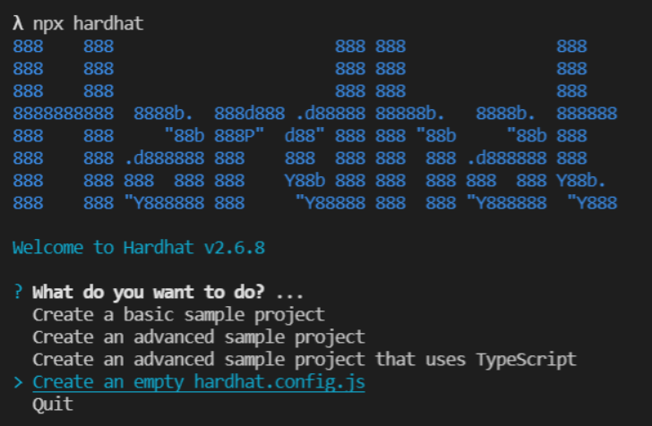
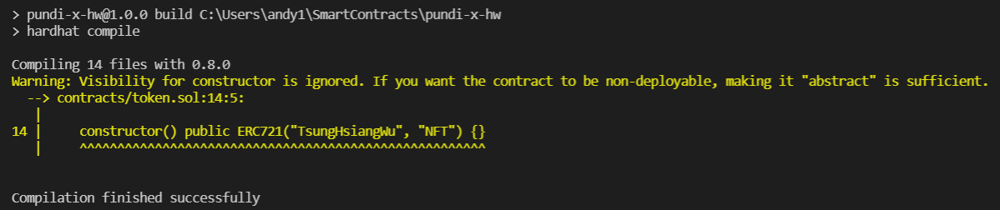

# Pundi X Assignment 
## Introduction
The project aims to publish a NFT token named by the author's name. We are going to implment the fundamental functions: ```mint```, ```burn``` and ```pause``` for users to interact with the smart contract. Also, the contract would be deploy to a testnet ([```ropsten```](https://ropsten.etherscan.io/) or [```rinkeby```](https://rinkeby.etherscan.io/)) so that we can directly verify the source code and operate on those functions.

## Prerequisites
- **Development Environment**

    To organize a simple project structure as well as to handle dependency issues with convenience, I strongly recommend that you install [```vscode```](https://code.visualstudio.com/), [```node```](https://nodejs.org/en/) and [```solidity plugin```](https://marketplace.visualstudio.com/items?itemName=JuanBlanco.solidity).

    Firstly we need to create a basic npm project with a command below, and corresponding configuration file [```package.json```](./package.json) would be created under the project.
    
	```command
    npm init -y
    ```
    
	Then we install [```hardhat```](https://hardhat.org/getting-started/) as a tool to to compile, deploy, test, and debug your Ethereum software. Remember to choose ```hardhat.config.js``` for first-created project, we would add some environment variables that are to be stated later to simplify the testing processes.
    
	```command
    npx hardhat
    ```
	
	
    
    
- **Dependencies**
    
    To enable local testing instead of constant deployment, [```hardhat```](https://hardhat.org/getting-started/) provides functionality focusing around Solidity debugging, featuring stack traces. Also, we would adopt it to deploy our smart contracts to testnet rather than complicated manual interaction with Etherscan.
    ```command
    npm install --save-dev hardhat
    ```
    [```@nomiclabs/hardhat-ethers```](https://hardhat.org/plugins/nomiclabs-hardhat-ethers.html) adds an ```ethers``` object to the Hardhat Runtime Environment, which allows you to interact with the Ethereum blockchain in a simple way.
    ```command
    npm install --save-dev @nomiclabs/hardhat-ethers
    ```
    [```@nomiclabs/hardhat-etherscan```](https://hardhat.org/plugins/nomiclabs-hardhat-etherscan.html) helps us verify the source code for your Solidity contracts on Etherscan.
    ```command
    npm install --save-dev @nomiclabs/hardhat-etherscan
    ```
    [```@nomiclabs/hardhat-waffle```](https://www.npmjs.com/package/@nomiclabs/hardhat-waffle) adds a ```waffle``` object to the Hardhat Runtime Environment. This object has all the Waffle functionalities, already adapted to work with Hardhat. And it is adopted to build smart contract tests using Waffle in Hardhat, taking advantage of both.
    ```command
    npm install --save-dev @nomiclabs/hardhat-waffle
    ```
    [```@openzeppelin/contracts```](https://www.npmjs.com/package/@openzeppelin/contracts) is a library for secure smart contract development, which implements standards like **ERC20** and **ERC721**.
    ```command
    npm install @openzeppelin/contracts
    ```
    [```chai```](https://www.chaijs.com/) is an assertion library applied for JavaScript testings, which is used in our test scripts.
    ```command
    npm install chai
    ```
    [```ethereum-waffle```](https://ethereum-waffle.readthedocs.io/en/latest/index.html) is a library for writing and testing smart contracts.
    ```command
    npm install --save-dev ethereum-waffle
    ```
    [```ethers```](https://docs.ethers.io/v5/) aims to be a complete and compact library for interacting with the Ethereum Blockchain and its ecosystem.
    ```command
    npm install --save ethers
    ```
    [```solidity-coverage```](https://github.com/sc-forks/solidity-coverage) assists us generate a testing report indicating code coverage for usecases.
    ```command
    npm install --save-dev solidity-coverage
    ```
    [```dotenv```](https://www.npmjs.com/package/dotenv) loads environment variables from a ```.env``` file, where we store our api key and private key, into ```process.env```. However, anyone should not reveal any information in ```.env``` file to strangers in prevent digital assets from being stolen.
    ```command
    npm install dotenv
    ```
    In order to use the latest stable version of the Solidity compiler via Node.js, [```solc```](https://www.npmjs.com/package/solc) is supposed to be installed.
    ```command
    npm install solc
    ```
    [```web3.js```](https://web3js.readthedocs.io/en/v1.5.2/) is a collection of libraries that allow you to interact with a local or remote ethereum node using HTTP, IPC or WebSocket.
    ```command
    npm install web3
    ```
    Once the above dependencies are installed, you would see the associated configurations appended into file ```package.json```:
    ```json
    "devDependencies": {
        "@nomiclabs/hardhat-ethers": "^2.0.2",
        "@nomiclabs/hardhat-etherscan": "^2.1.7",
        "@nomiclabs/hardhat-waffle": "^2.0.1",
        "@openzeppelin/contracts": "^4.3.3",
        "chai": "^4.3.4",
        "ethereum-waffle": "^3.4.0",
        "ethers": "^5.5.1",
        "hardhat": "^2.6.8",
        "solidity-coverage": "^0.7.17"
    },
    "dependencies": {
        "dotenv": "^10.0.0",
        "solc": "^0.8.10",
        "web3": "^1.6.0"
    }    
    ```
- **Configurations**
    
    **-- [```package.json```](./package.json)**
	
    Let's get deeper into the configurations of the project. In the beginning, [```package.json```](./package.json) is investigated to know how do we build the solidity code, test, and deploy the smart contract into the testnet.
    ```json
    "scripts": {
        "build": "hardhat compile",
        "test:light": "hardhat test",
        "test": "hardhat coverage",
        "deploy:local": "hardhat run --network localhost scripts/deploy-token.js",
        "deploy:ropsten": "hardhat run --network ropsten scripts/deploy-token.js",
        "deploy:rinkeby": "hardhat run --network rinkeby scripts/deploy-token.js",
        "local-testnet": "hardhat node"
    }
    ```
    In [node](https://nodejs.org/en/), when we initialize the project, [```package.json```](./package.json) provides ```scripts``` property for developers to self-define execution commands so that we can run tasks in the form: ```npm run [script field]```. Here we have provided all commands needed to build, test and deploy the smart contract which are to be demonstrated in the following sections.
    
    **-- [.env](./.env)**
	
    In order to test, deploy and verify our contract to testnet, anyone should put his/her ```ETHERSCAN_API_KEY```, ```API_URL```, ```PRIVATE_KEY``` in this file for plugin [```dotenv```](https://www.npmjs.com/package/dotenv) to load into the evironment. But notice that ```never disclose the file to others otherwise your digital assets risk of being stolen```.
    ```.env
    ETHERSCAN_API_KEY={etherscan api key}
    API_URL="https://eth-ropsten.alchemyapi.io/v2/{alchemy api key}"
    PRIVATE_KEY="{wallet private key}"
    ```
    To get an etherscan api key, please create an [etherscan account](https://etherscan.io/login) and follow the [post](https://medium.com/etherscan-blog/psa-for-developers-implementation-of-api-key-requirements-starting-from-february-15th-2020-b616870f3746) to get an api key for the application.
    
	To get an alchemy api key, please create an [alchemy account](https://auth.alchemyapi.io/?redirectUrl=https%3A%2F%2Fdashboard.alchemyapi.io) and follow the [post](https://docs.alchemy.com/alchemy/introduction/getting-started) to get an api key for the application.
    
	To get a private key, please apply for a crypto wallet (ex: [MetaMask](https://metamask.io/)) and follow the [post](https://metamask.zendesk.com/hc/en-us/articles/360015289632-How-to-Export-an-Account-Private-Key) to export your own private key.
    
    **-- [hardhat.config.js](./hardhat.config.js)**
	
    For the first time plugin [```hardhat```](https://hardhat.org/getting-started/) is installed, the file is generated correspondingly. To enable building, testing and deplyment to work as usual, the configuration comes as below:
    ```js
    require("@nomiclabs/hardhat-waffle");
    require("@nomiclabs/hardhat-etherscan");
    require('solidity-coverage');
    require('dotenv').config();
    ```
    For each plugin, we have described the related contents in the **Dependencies** section, for testing/deployment usage, here we apply [```@nomiclabs/hardhat-waffle```](https://www.npmjs.com/package/@nomiclabs/hardhat-waffle), [```@nomiclabs/hardhat-etherscan```](https://hardhat.org/plugins/nomiclabs-hardhat-etherscan.html), [```solidity-coverage```](https://github.com/sc-forks/solidity-coverage) and [```dotenv```](https://www.npmjs.com/package/dotenv)
    ```js
    const { ETHERSCAN_API_KEY, API_URL, PRIVATE_KEY } = process.env;
    ```
    Besides that, evironment variables are loaded into the script as the arguments to deploy a contract to the testnet. If you see the ```scripts``` property in [```package.json```](./package.json), we have specified which testnet we would like to deploy for testing. What we should do is to specifiy the corresponsive parameters indicated below:
    ```js
    module.exports = {
        networks: {
            hardhat: {},
            ropsten: {
            url: API_URL,
            accounts: [`0x${PRIVATE_KEY}`]
        },
        rinkeby: {
            url: API_URL,
            accounts: [`0x${PRIVATE_KEY}`]
        }
      },
      etherscan: {
        apiKey: `${ETHERSCAN_API_KEY}`
      },
      solidity: {
        version: "0.8.0",
        settings: {
            optimizer: {
                enabled: true,
                runs: 200
            }
        }
      },
      paths: {
        sources: "./contracts",
        tests: "./test",
        cache: "./cache",
        artifacts: "./artifacts"
      },
    };
    ```
    Notice that there is a propery ```etherscan``` that contains the ```ETHERSCAN_API_KEY```. As for publishing our solidity code to etherscan and verifying the service, we need to provide a ```deployed contract address```. In the following sections we would demonstrate how we achieve that.

## Build & Test
The source code is under the directory [constracts](./contracts), to compile the code just type the command below:
```command
npm run build
```
Note that the command would trigger the ```build``` field of ```scripts``` property in [```package.json```](./package.json) so that ```hardhat``` plugin compiles the source. The result is shown as below:



Identically, test scripts are placed under the directory [test](./test), to test the use cases just type the command below:
```command
npm run test
```
Note that the command would trigger the ```test``` field of ```scripts``` property in [```package.json```](./package.json) so that ```hardhat``` plugin validates the source. The result is shown as below:


## Deploy a Token

The script [deploy-token.js](./scripts/deploy-token.js) has provided instructions to deploy our contract with the account address; show the contract address thereafter. As mentioned before, the configuration file [package.json](./package.json) provides the ```scripts``` property helping us shorthen the deployment commands.
```json
"deploy:ropsten": "hardhat run --network ropsten scripts/deploy-token.js"
"deploy:rinkeby": "hardhat run --network rinkeby scripts/deploy-token.js"
```
As per the requirements of the assignment, we could choose [ropsten](https://ropsten.etherscan.io/)/[rinkeby](https://rinkeby.etherscan.io/) as a deployment target. Here I choose to deploy my contract to [ropsten](https://ropsten.etherscan.io/) as an example. You could choose another one; give it a try.
```command
npm run deploy:ropsten
```
And the console would show the execution result indicating the account address and the deployed contract address, as below:


Also, we can check deployment status on testnet [ropsten](https://ropsten.etherscan.io/) by given contraction address.


## Verify Code on Etherscan

In the configuration file [package.json](./package.json), the field ```etherscan``` property has been filled with a secret key. We are going to verify contract services with the aid of the plugin [hardhat-etherscan](https://hardhat.org/). Anyone could consullt the [page](https://hardhat.org/plugins/nomiclabs-hardhat-etherscan.html) for details.

From the last section, we have known the deployed contract address. Therefore when we would like to verify contract services, please type the command as below:
```command
npx hardhat verify --network [TESTNET/MAINNET_NAME] [DEPLOYED_CONSTRACT_ADDR] "[CONSTRUCTOR_ARGS]"
```
Well, in the assignment I apply [ropsten](https://ropsten.etherscan.io/) as the testnet, and because my contract doesn't need any constructor argument. So I would verify the contract service as below:
```command
npx hardhat verify --network ropsten [CONSTRACT_ADDR]
```
And the console shows the verification result declaring that the source code has been submitted to etherscan and verified as well with a link given. Try open it and interact with the contract to check if the functions could work as usual.


## Interact with the Deployed Contract

When the contract service is verified a link is given so that you can open it; review the submitted source code and interact with the function ```mint```, ```burn``` and ```pause```.


**Case [1]**: mint a token, the mint function should trigger a transaction and succeed.


**Case [2]**: burn a token with tokenId = 1, the burn function should trigger a transaction and succeed.


**Case [3]**: burn function should be reverted since it's going to burn a non-existent tokenId = 1.


**Case [4]**: pause function should trigger a transaction to diable ```mint``` and ```burn``` functions.


**Case [5]**: mint function should be reverted since all transactions have been paused in case [4]


**Case [6]**: burn function should be reverted since all transactions have been paused in case [4]


**Case [7]**: unpause function should trigger a transaction to enable ```mint``` and ```burn``` functions.


All transactions of the deployed contract address are listed here corresponding to the above use cases.


Thumbs up!